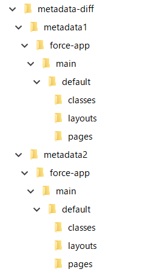
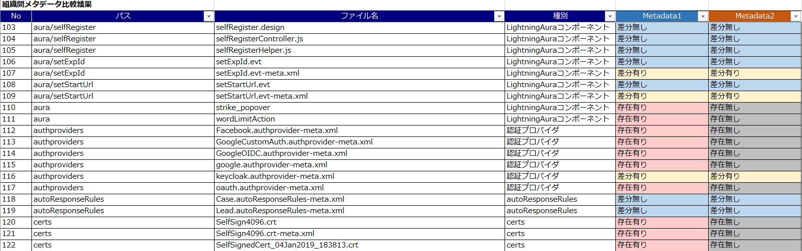
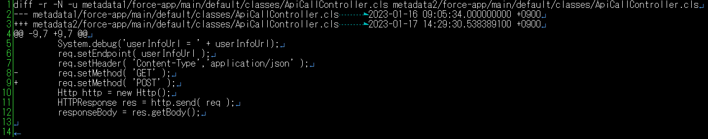

# metadata-diff
<p align="center">
  
  
  
  
</p>
diffコマンドにより出力したSalesforceのメタデータの差分結果から、Excelによる差分一覧の出力とメタデータファイル毎の差分結果分割を行います。

## インストール
[Node.js](https://nodejs.org/)をインストールし、以下のファイルを任意のディレクトリに配置します。

* generate_diff_list.js
* slice_diff_result.js
* template.xlsx
* package.json
* package-lock.json

以下のコマンドを実行し、必要なライブラリをインストールします。
```
$ npm ci
```

また、本ツールはUNIX準拠のdiffコマンドによるメタデータの差分出力が必要となります。
Git附属のdiffコマンドなどを使用してください。動作確認しているdiffのバージョンは「diff (GNU diffutils) 3.7」となります。

## メタデータの差分の取得
本ツールはmetadata1とmetadata2のフォルダに比較対象のメタデータを配置することを前提としています。また、メタデータはsfdxのソース形式とする必要があります。以下はmetadata-diffフォルダ配下で作業する場合のメタデータの配置例です。  
[](./images/metadata.png)

diffコマンドでメタデータの差分一覧を取得する場合は、以下と同様のオプションを指定して取得してください。ここで取得したdiff_list.txtはgenerate_diff_list.jsで使用します。
```
$ diff -r -q --binary -b -s metadata1 metadata2 > diff_list.txt
```

また、diffコマンドでメタデータの差分を取得する場合は、以下と同様のオプションを指定して取得してください。ここで取得したdiff.txtはslice_diff_result.jsで使用します。
```
$ diff -r -N -u metadata1 metadata2 > diff.txt
```

## メタデータの差分一覧の取得
ターミナルでNode.jsを使用してgenerate_diff_list.jsを実行します。パラメータに対象となるdiffの差分一覧のテキストファイルを指定します。
```
$ node generate_diff_list.js diff_list.txt
```
実行が成功すれば、以下のdiff_list.xlsxが作成されます。  
[](./images/diff_list.png)

差分がない行も出力したい場合は-iオプションを指定します。
```
$ node generate_diff_list.js diff_list.txt -i
```

出力するExcelファイル名の指定する場合は、-oオプションで指定します。
```
$ node generate_diff_list.js diff_list.txt -o diff_list2.xlsx
```

ExcelのヘッダのMetadata1、Metadata2の名前の変更する場合は-m1、-m2オプションで指定します。
```
$ node generate_diff_list.js diff_list.txt -m1 Sandbox_dev -m2 Sandbox_full
```

実行時に使用可能なオプションは以下となります。
```
usage: generate_diff_list.js [-options] target_diff_list_file
    -h                  output usage information
    -o <outputname>     specifies output file name(default is diff_list.xlsx)
    -m1 <metadata1name> specifies the name of metadata1 in excel(default is Metadata1)
    -m2 <metadata2name> specifies the name of metadata2 in excel(default is Metadata2)
    -i                  include identical line
````

## メタデータファイル毎の差分結果分割
ターミナルでNode.jsを使用してslice_diff_result.jsを実行します。パラメータに対象となるdiffの差分のテキストファイルを指定します。  
```
$ node slice_diff_result.js diff.txt
```
実行が成功すれば、対象のメタデータファイル名がコンソールに出力され、diff_resultフォルダに分割した差分ファイルがフォルダ毎に格納されます。  
以下は例として、ApiCallControllerのApexクラスで差分があった場合の出力例です。  
[](./images/diff.png)

上記は「./diff_result/force-app/main/default/classes/ApiCallController.cls」に格納されています。

出力するフォルダの指定する場合は、-oオプションで指定します。
```
$ node slice_diff_result.js diff.txt -o diff_result2
```

実行時に使用可能なオプションは以下となります。
```
usage: slice_diff_result.js [-options] target_diff_file
    -h              output usage information
    -o <outputname> specifies output path(default is diff_result)
````

## 注意事項
- WindowsとMacのプラットフォームの違いや、diffコマンドによってはデフォルトの文字コードが異なるため、うまく動作しない可能性があります。その場合は、各スクリプトのDEFAULT_DIFF_CHARSETをUTF-8、またはShift-JIS等に変更してください。デフォルトではUTF-8としています。

## ライセンス
metadata-diffはMITライセンスを適用しています。
